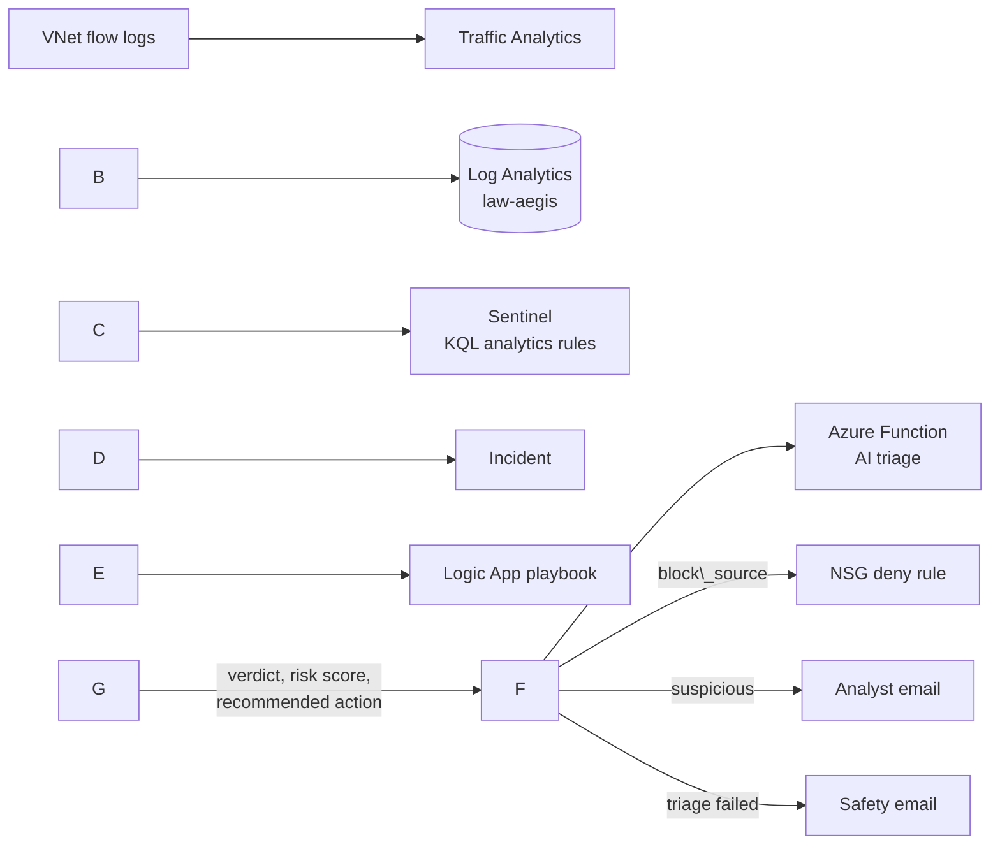

# Aegis: Cloud-Native Network Telemetry \& Automated Triage Engine

**Detect, triage with AI, and respond automatically, built on Microsoft Sentinel.**

Aegis finds port scans and other suspicious network behaviour in Azure, judges each alert against real traffic evidence, and acts: it blocks a confirmed hostile source, emails an analyst when a human is needed, and logs benign alerts without noise. Detection rules are stored as code and redeploy with one command.

## Highlights

* **End-to-end SOAR pipeline:** flow logs, KQL detections, AI triage, and automated response in one Azure-native build.
* **Evidence-based AI triage:** the LLM judges real flow data and an AbuseIPDB score, not a bare alert title, and returns structured JSON.
* **Safe automation:** an auto-block needs a `malicious` verdict and a risk score of at least 75, uses one named reversible NSG rule, and has a documented rollback.
* **Detection-as-Code:** analytics rules in Bicep and ARM, rebuilt from files with the same rule ID and settings.
* **Caught real attackers:** unrelated internet scanners hit the lab within days, and Aegis flagged them.

## Architecture



|Layer|Implementation|
|-|-|
|Data|Azure VNet flow logs, Traffic Analytics, Log Analytics (`NTANetAnalytics`)|
|Detection|5 scheduled KQL rules on ASIM `\_Im\_NetworkSession`|
|Triage|Python 3.12 Azure Function, Groq `openai/gpt-oss-120b`, AbuseIPDB|
|Response|Logic App playbook, managed identity, Outlook email|
|As code|Bicep and ARM, deployed with Azure CLI|

## Detection

Rules come from the Network Session Essentials solution and work on normalised data, so they do not depend on one log format.

|Rule|Detects|As code|
|-|-|-|
|Port scan detected|One external source probing 50+ distinct ports in 5 minutes (MITRE T1046)|Yes|
|Network Port Sweep from External Network|External source sweeping ports or hosts|Yes|
|Detect port misuse by static threshold|Port activity above a fixed limit|Yes|
|Potential beaconing activity|Regular repeated connections typical of command and control|Yes|
|Detect port misuse by anomaly based detection|Port activity unusual against a baseline|Not yet|

The Port scan rule uses Microsoft's template query. I tuned its incident settings: alert grouping by IP, 24-hour lookback, reopen closed incidents. A persistent scanner now produces one incident and one email, not hundreds.

## AI triage

An HTTP-triggered Azure Function. For each alert it queries the real flow data around the alert time, adds the source IP's AbuseIPDB score (90-day window), and asks the LLM to reason over those facts.

**Output:** a verdict (`malicious`, `suspicious`, `benign`, `insufficient\_data`), a risk score, MITRE mapping, the score factors behind the score, and a recommended action: `block\_source` (malicious external source), `isolate\_host` (malicious internal source), or `notify\_analyst`. Block and isolate recommendations are downgraded to `notify\_analyst` unless the score is at least 75.

**Why it works:** the LLM has no internet and no memory, so it can only use what is placed in front of it. The first version judged from the alert title and gave vague answers. The rebuilt version supplies measured evidence and handles empty data explicitly instead of inventing detail.

## Automated response

The playbook runs on every new Sentinel incident:

1. Extract the IP entities and call the triage function.
2. **`malicious` + `block\_source`:** create the deny rule `aegis-auto-block` on the victim VM's NSG (managed identity, Network Contributor) and email the analyst with undo steps.
3. **Score of 40 or more, or any verdict other than benign:** email the analyst with verdict, score, MITRE technique and score factors.
4. **Otherwise:** add a comment to the incident and send no email.
5. **Triage failure:** send a safety email, so a broken function never means a silently ignored incident.

**Rollback:**

```powershell
az network nsg rule delete --resource-group rg-aegis --nsg-name vm-test1-nsg --name aegis-auto-block
```

## Detection-as-Code

Each rule is stored in [`detections/`](detections/) as Bicep and ARM JSON, holding the full rule: KQL query, schedule, severity, MITRE tactics, entity mappings and grouping. The only input is the workspace name.

```powershell
az deployment group create `
  --resource-group rg-aegis `
  --template-file detections/port-scan-detected.bicep `
  --parameters workspace=law-aegis
```

**Verified:** the Port scan rule was deleted in Sentinel and rebuilt from its ARM file with the same rule ID and settings. Its Bicep version was then deployed over the live rule and updated it in place.

## Results

* **Own scan:** a 1,000-port `nmap` scan was detected and taken through the full incident workflow, then closed as Benign Positive (an authorised test).
* **Real scanners:** one internet source touched 639 ports in one window. Triage rated it suspicious and recommended notifying an analyst.
* **Automated block:** tested end to end, including the notification email.

|Incident graph|Alert email|Rule restored from code|
|-|-|-|
|!\[Incident graph](docs/incident-graph.png)|!\[Alert email](docs/alert-email.png)|!\[Rule restored](docs/rule-restored.png)|

## Challenges solved

|Problem|Fix|
|-|-|
|Triage query returned nothing: `NTANetAnalytics` uses `SrcIp`, `DestIp`, `DestPort`, `FlowStatus`, not the names I assumed|Checked the real schema and rewrote the query|
|Empty results with no error: a time span in the client call conflicted with the KQL's own time filter|Removed the conflict|
|Scan through a free VPN showed every port open: the exit node answered for the target|Dropped the VPN and scanned from a direct IP|
|Duplicate alert emails from one persistent scanner|24-hour alert grouping by IP|
|ARM export would not convert to Bicep: `az bicep decompile` rejects the resource `id` line|Converted copies without that line; originals unchanged|

## Limitations and roadmap

* With 24-hour grouping, a scan that escalates inside an already-open incident does not re-trigger the playbook. Planned fix: re-run the playbook when a worse alert joins an open incident.
* One auto-block is active at a time (single fixed rule name).
* `isolate\_host` is emailed to an analyst; automatic host isolation is not built.
* The anomaly rule is not exported as code yet, and only the Port scan rule has had a full delete-and-rebuild test.
* Planned: an approval step for blocks, inside an authenticated console.

## Safety

* Test scans target only my own VMs, from my own machines and an attacker VM inside the lab network.
* Automatic blocking is limited to one named, reversible rule in the lab NSG.
* No keys, tokens, function URLs or personal addresses are stored in this repo.

## Repository

```
AEGIS/
├── detections/        Sentinel analytics rules (Bicep + ARM JSON)
├── triage-function/   Azure Function for AI triage
├── logic-app/         Playbook definition
└── docs/              Screenshots
```

Secrets are read from environment variables. In `logic-app/`, values in angle brackets such as `<FUNCTION\_KEY>` are placeholders to fill before importing.

## Skills

KQL and ASIM · Microsoft Sentinel · Log Analytics · Azure networking (VNets, NSGs, flow logs) · SOAR playbooks (Logic Apps) · Detection-as-Code (Bicep, ARM) · Azure Functions (Python) · LLM triage grounded in evidence · Incident response · MITRE ATT\&CK

\---

**Built by Afzal**, final-year B.E. Computer Science (2027), Chennai. Open to SOC Analyst and security automation roles (Chennai or remote). GitHub: [Afzal2301](https://github.com/Afzal2301)

